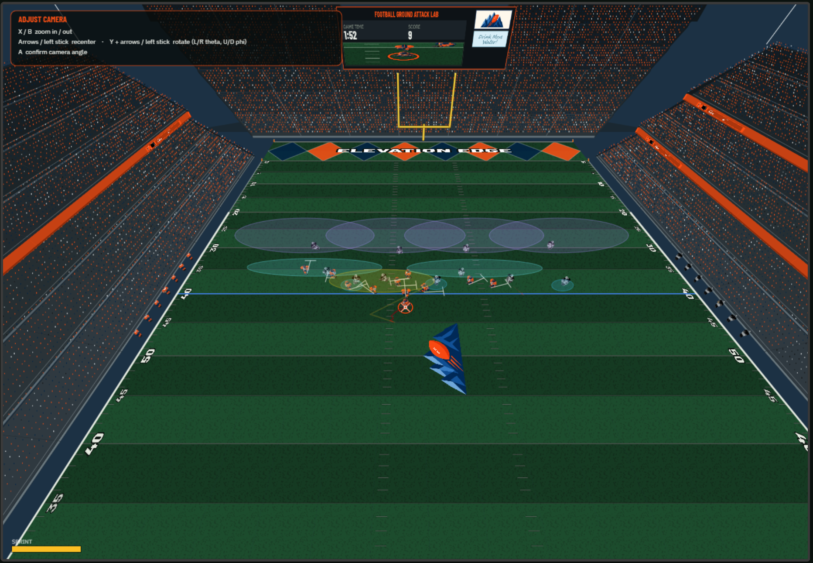
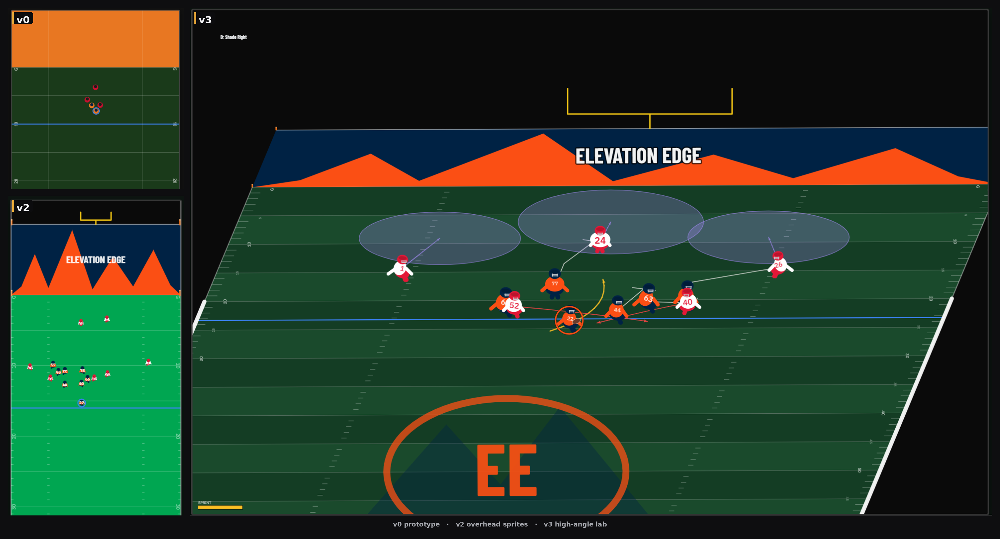

# Football Ground Attack Lab

Customizable running-back lab on a single HTML5 canvas. **Version 8.** Play as offense (default) or defense.

**[Play](https://elevation-edge-sports-data.github.io/football-ground-attack-lab/)** · [GitHub](https://github.com/elevation-edge-sports-data/football-ground-attack-lab)

Earlier versions (v0, v2, v3):

Not affiliated with, endorsed by, or licensed by any league or team.

## Features

1. **Play as Offense or Defense.** Offense is the default. Defense starts on the free safety (deepest middle DB; else deepest middle LB; else middle DT)
2. Authored **offense playbook** (6): Blast, Pitch, Sweep, River, Zig Zag, Wedge
3. Authored **defense playbook** (6): Quarters, Overload, Prevent / Cloud, Bear, Fire Zone, Walk-Up
4. Side playbook panel: numbered lists, miniature assignment diagrams (**Practice only**)
5. Pre-snap field diagrams; offense and defense assigned independently
6. **Game** and **Practice** modes (Practice is default)
7. **Next play:** On snap (A / Y) or Automatic. Defense Automatic huddles **2–3 seconds** (uniform random each play) so you can switch and shade, then snaps. **Y** still snaps immediately
8. After the snap, a short handoff or pitch from QB to runner when a QB is on the field
9. Optional runner path trail; trail in instant replay
10. Save last play (up to 10 clips)
11. **Freestyle camera** (default) plus angled 2D, overhead, high, zoom, and wide
12. Madden-style **instant replay**: zoom, slow-mo, fast scrub, pan, spherical orbit (theta / phi)
13. Volume player models with pose changes for dive, juke, spin, truck, stiff-arm, pancake, wrap, hit stick
14. Stadium bowl: sectioned stands, crowd, press box, lights, 3D goal posts, dual scoreboards, jumbotron
15. Optional fumbles; celebrate (off on Classic); speed burst in the clear; TD camera zoom
16. Personnel counts for OL, TE, FB, QB, DT, LB, DB. One DB stands middle-center; two DBs keep the middle pair
17. Speed, offense, defense, break-block, and break-tackle sliders
18. Variable field width; Natural Grass, Field Turf, or Astro Turf
19. Uniform banner (8 kits). Matching kits are not allowed. Kits are unlabeled colors. User-controlled defenders get a team-color ring, same as the ball carrier
20. Game Config: own/opponent start on a 50-yard scale; after a score = Random, Fixed, Increasing, or Decreasing
21. Diamond or mountain endzones, custom endzone text, midfield Elevation Edge logo
22. Goal posts, pylons, ball spotted on the hashes
23. Keyboard and Xbox controls; Basic (v1), Expanded (v2), Wings (v3), Independent (v4), Classic (v6 default)
24. D-pad is eight extra moves (hurdle, dead-leg, shake, and diagonals)
25. Fatigue toggle: off keeps speed burst at full power. On, the meter waits 3 seconds of continuous use before it depletes
26. Practice 6×6 book: no clock; line of scrimmage stays on the Practice control; RT flips offense only, LT flips defense only (offense huddle)

## Play calling (pre-snap)

**Practice** — playbooks and dropdowns. Set both the offense play and the defense scheme. First huddle randomizes both, then the call sticks until you change it.

**Game** — playbooks are hidden. Both calls re-roll after every play. Names are labels, not dropdowns. You only pick the side you play as (offense play on offense, defense scheme on defense) — and Game still re-rolls both.

Click a playbook preview to focus it (Practice), or use the menu keys below.

| Action | Key | Xbox |
|---|---|---|
| Snap | Enter / Y | A hold / Y |
| Offense menu (Practice) | C | X |
| Defense menu (Practice) | F | B |
| Cancel audible | V / Y | Y |
| Flip offense (Practice) | X | RT |
| Flip defense (Practice) | Z | LT |
| Browse list | W / S or ↑ ↓ | Left stick |
| Pick play 1–6 | **1–6** | — |

During an **offense** play, Z/X or LT/RT independently select the nearest teammates to the left and right (Wings / Independent / Classic). On **defense**, LT / RT are wrap and punch — not teammate steer.

## Defense controls

Default controlled defender is the **free safety**. The next huddle restores whoever you had selected **at the previous snap** (not a mid-play B-switch).

### Huddle

| Action | Key | Xbox |
|---|---|---|
| Cycle defender | A / B tap, `[` `]` / `,` `.` | A tap / B tap |
| Point-select | F + WASD | B + left stick |
| Shade / align | WASD | Left stick |
| Snap now | Y (quiet) / Enter | Y / A hold (~0.4s) / Start |
| Auto-snap | — | Automatic next play: random **2–3s** huddle, then snap |

Cycle order is left DT → right DT → LBs → DBs, but the huddle **starts on the FS**, not the left DT.

### Live

| Action | Key | Xbox |
|---|---|---|
| Move | WASD / Arrows | Left stick |
| Sprint | Space | A |
| Switch defender | F | B (D-pad aims; else best / second-best pursuit on the ball) |
| Point-select | F + WASD | B + left stick |
| Dive | C | X |
| Shed block | V / Y | Y |
| Wrap | — | LT |
| Punch / strip | — | RT |
| Strafe | Shift | LB **or** RB (either is enough) |
| Hit stick | — | Right stick flick |

**Strafe** — the defender breaks down, squares his hips, and is more likely to wrap, deliver a big hit, and force a fumble. Strike zone opens up. Speed is reduced while it is held.

**Wrap + punch** — LT wraps, RT punches. Best as a sequence, especially from an angle.

**Hit stick** — RS flick. Connect and it is a crush (fumble chance); miss and you whiff. Strafe widens the window.

## Runner controls (offense)

Default profile is **Classic (v6)**.

| Action | Key | Xbox (Classic) |
|---|---|---|
| Move | WASD / Arrows | Left stick |
| Speed burst | Space | A |
| Spin | F | B |
| Dive | C | X |
| Truck | V / Y | Y |
| Juke | Q / E | LB / RB |
| Steer teammates | Z / X | LT / RT (live play) |
| Stiff left | J (with I) | View / Select |
| Stiff right | L (with I) | Menu / Start |
| Peek defense | H | — |
| Replay | R | View |
| Pause | P | Click right stick |

No celebrate button on Classic (v6). Fumbles stay off while Classic is selected.

The D-pad is eight extra moves. The same eight are on the keyboard: I J K L are up, left, down, right; hold two keys for a diagonal.

| Move | D-pad | Keys |
|---|---|---|
| Hurdle | Up | I |
| Hurdle left | Up-left | I + J |
| Hurdle right | Up-right | I + L |
| Dead-leg | Down | K |
| Dead-leg left | Down-left | K + J |
| Dead-leg right | Down-right | K + L |
| Shake left | Left | J |
| Shake right | Right | L |

A resumes pause. B restarts from pause (not while adjusting the camera).

Microsoft Edge is recommended for an Xbox controller.

### Profiles

- **Basic (v1)** — D-pad steers the runner. LT / RT stiff. Start pauses.
- **Expanded (v2)** — D-pad is the eight extra moves. LT / RT stiff. Click RS to pause.
- **Wings (v3)** — LT and RT independently select the nearest teammates to the left and right. One stick directs the ball carrier and those teammates together. Y hurdles. D-pad up-left / up-right stiff.
- **Independent (v4)** — T-9 compatible. Independently steer ball carrier and teammates using left and right sticks.
- **Classic (v6)** — Built on Independent (v4). Select / View stiff left, Start / Menu stiff right. No celebrate, so fumbles stay off.

## Cameras

**Freestyle** is the default live view. Pause, then press Y to adjust: X/B zoom, left stick recenter, hold Y + left stick orbit (left/right = theta, up/down = phi), A confirm. Stick movement is relative to the camera.

**Instant replay** — after a play, Pause then X, or press View / R. Clip starts at the snap.

| Replay | Xbox |
|---|---|
| Pause / play | A |
| Zoom in / out | X / B |
| Slow-mo back / forward | LB / RB |
| Fast back / forward | LT / RT |
| Pan the look-at X | Left stick |
| Orbit | Hold Y + left stick |

## Modes

**Game** — session clock, score, yards, TDs. After a score, the next line of scrimmage follows Game Config (Random / Fixed / Increasing / Decreasing). Both the offense play and the defense scheme re-roll every play. Playbooks are hidden; call names are labels. Playing defense, Automatic is the default next-play setting.

**Practice** — 6 offense × 6 defense. No clock. Practice Config sets the yard; every new play starts from that yard (gains and scores do not move the ball). Playbooks and dropdowns stay up. RT flips the offense book only; LT flips the defense book only. Next play defaults to On snap. Automatic uses the same 2–3s defense huddle as Game.

## Defaults

- Mode: Practice
- Play as: Offense
- Next play: On snap (A). Switching to Game sets Automatic. Switching Play as does not overwrite the next-play setting
- Start: midfield
- After a score (Game): Random (own 20–opponent 20, 5-yard lines)
- Speed 1.20× · Offense 1.00× · Defense 1.00×
- Break block 1.00× · Break tackle 1.00×
- Fatigue on (3 s grace, then the burst meter depletes)
- Fumbles off (Classic has no celebrate)
- Runner path trail on
- Camera: Freestyle
- Replay: PiP
- Offense and defense start on different kits
- Clock: 2:00 (Game only)
- Field width: 50 yards
- Control profile: Classic (v6)

## Tech

`index.html` + `game.js` + `styles.css` + `ee-logo.png`. Canvas and JavaScript. No dependencies. Works offline.

`screenshot.png` is the v7 capture for now.

Built by [Zach Sajevic](https://github.com/elevation-edge-sports-data)  
Elevation Edge Sports Data
