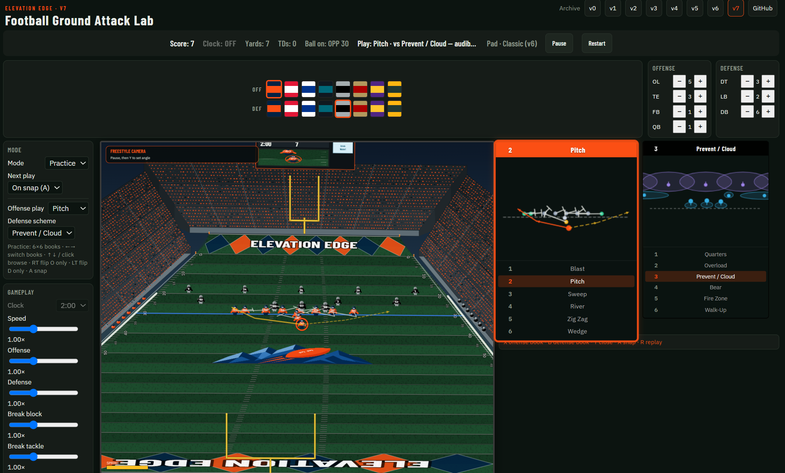

# Football Ground Attack Lab

Customizable running-back lab on a single HTML5 canvas. **Version 7.**

**[Play](https://elevation-edge-sports-data.github.io/football-ground-attack-lab/)**

Earlier versions (v0, v2, v3):

Not affiliated with, endorsed by, or licensed by any league or team.

## Features

1. Authored **offense playbook** (6): Blast, Pitch, Sweep, River, Zig Zag, Wedge
2. Authored **defense playbook** (6): Quarters, Overload, Prevent / Cloud, Bear, Fire Zone, Walk-Up
3. Side playbook panel: numbered lists, miniature assignment diagrams
4. Pre-snap field diagrams; offense and defense assigned independently
5. **Game** and **Practice** modes (Practice is default). Same play-calling tools in both
6. Snap on **A** by default; optional automatic next play
7. After the snap, a short handoff or pitch from QB to runner when a QB is on the field
8. Optional runner path trail; trail in instant replay
9. Save last play (up to 10 clips)
10. **Freestyle camera** (default) plus angled 2D, overhead, high, zoom, and wide
11. Madden-style **instant replay**: zoom, slow-mo, fast scrub, pan, spherical orbit (theta / phi)
12. Volume player models with pose changes for dive, juke, spin, truck, stiff-arm, pancake
13. Stadium bowl: sectioned stands, crowd, press box, lights, 3D goal posts, dual scoreboards, jumbotron
14. Optional fumbles; celebrate (off on Classic); speed burst in the clear; TD camera zoom
15. Personnel counts for OL, TE, FB, QB, DT, LB, DB
16. Speed, offense, defense, break-block, and break-tackle sliders
17. Variable field width; Natural Grass, Field Turf, or Astro Turf
18. Uniform banner (8 kits). Matching kits are not allowed. Kits are unlabeled colors
19. Game Config: own/opponent start on a 50-yard scale; after a score = Random, Fixed, Increasing, or Decreasing
20. Diamond or mountain endzones, custom endzone text, midfield Elevation Edge logo
21. Goal posts, pylons, ball spotted on the hashes
22. Keyboard and Xbox controls; Basic (v1), Expanded (v2), Wings (v3), Independent (v4), Classic (v6 default)
23. D-pad is eight extra moves (hurdle, dead-leg, shake, and diagonals)
24. Fatigue toggle: off keeps speed burst at full power. On, the meter waits 3 seconds of continuous use before it depletes
25. Practice 6×6 book: no clock; line of scrimmage stays on the Practice control; RT flips offense only, LT flips defense only

## Play calling (pre-snap)

Click a playbook preview to focus it, or use the menu keys below.

| Action | Key | Xbox |
|---|---|---|
| Snap | Enter | A |
| Offense menu | C | X |
| Defense menu | F | B |
| Cancel audible | V / Y | Y |
| Flip offense | X | RT |
| Flip defense | Z | LT |
| Browse list | W / S or ↑ ↓ | Left stick |
| Focus offense / defense | ← / → | — |
| Pick play 1–6 | **1–6** | — |

During the play, Z/X or LT/RT independently select the nearest teammates to the left and right (Wings / Independent / Classic).

## Runner controls

Default profile is **Classic (v6)**.

| Action | Key | Xbox (Classic) |
|---|---|---|
| Move | WASD / Arrows | Left stick |
| Speed burst | Space | A |
| Spin | F | B |
| Dive | C | X |
| Truck | V / Y | Y |
| Juke | Q / E | LB / RB |
| Steer teammates | Z / X | LT / RT (live play) |
| Stiff left | J (with I) | View / Select |
| Stiff right | L (with I) | Menu / Start |
| Peek defense | H | — |
| Replay | R | View |
| Pause | P | Click right stick |

No celebrate button on Classic (v6). Fumbles stay off while Classic is selected.

The D-pad is eight extra moves. The same eight are on the keyboard: I J K L are up, left, down, right; hold two keys for a diagonal.

| Move | D-pad | Keys |
|---|---|---|
| Hurdle | Up | I |
| Hurdle left | Up-left | I + J |
| Hurdle right | Up-right | I + L |
| Dead-leg | Down | K |
| Dead-leg left | Down-left | K + J |
| Dead-leg right | Down-right | K + L |
| Shake left | Left | J |
| Shake right | Right | L |

A resumes pause. B restarts from pause (not while adjusting the camera).

Microsoft Edge is recommended for an Xbox controller.

### Profiles

- **Basic (v1)** — D-pad steers the runner. LT / RT stiff. Start pauses.
- **Expanded (v2)** — D-pad is the eight extra moves. LT / RT stiff. Click RS to pause.
- **Wings (v3)** — LT and RT independently select the nearest teammates to the left and right. One stick directs the ball carrier and those teammates together. Y hurdles. D-pad up-left / up-right stiff.
- **Independent (v4)** — T-9 compatible. Independently steer ball carrier and teammates using left and right sticks.
- **Classic (v6)** — Built on Independent (v4). Select / View stiff left, Start / Menu stiff right. No celebrate, so fumbles stay off.

## Cameras

**Freestyle** is the default live view. Pause, then press Y to adjust: X/B zoom, left stick recenter, hold Y + left stick orbit (left/right = theta, up/down = phi), A confirm. Stick movement is relative to the camera.

**Instant replay** — after a play, Pause then X, or press View / R. Clip starts at the snap.

| Replay | Xbox |
|---|---|
| Pause / play | A |
| Zoom in / out | X / B |
| Slow-mo back / forward | LB / RB |
| Fast back / forward | LT / RT |
| Pan the look-at X | Left stick |
| Orbit | Hold Y + left stick |

## Modes

**Game** — session clock, score, yards, TDs. After a score, the next line of scrimmage follows Game Config (Random / Fixed / Increasing / Decreasing). Playbook and audibles are available.

**Practice** — 6 offense × 6 defense. No clock. Practice Config sets the yard; every new play starts from that yard (gains and scores do not move the ball). RT flips the offense book only; LT flips the defense book only.

## Defaults

- Mode: Practice
- Next play: on snap (A)
- Start: midfield
- After a score (Game): Random (own 20–opponent 20, 5-yard lines)
- Speed 1.20× · Offense 1.00× · Defense 1.00×
- Break block 1.00× · Break tackle 1.00×
- Fatigue on (3 s grace, then the burst meter depletes)
- Fumbles off (Classic has no celebrate)
- Runner path trail on
- Camera: Freestyle
- Replay: PiP
- Offense and defense start on different kits
- Clock: 2:00 (Game only)
- Field width: 50 yards
- Control profile: Classic (v6)

## Tech

`index.html` + `game.js` + `styles.css` + `ee-logo.png`. Canvas and JavaScript. No dependencies. Works offline.

Built by [Zach Sajevic](https://github.com/elevation-edge-sports-data)  
Elevation Edge Sports Data
